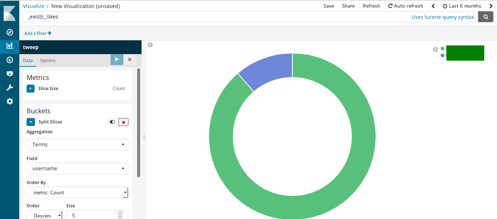

# Elasticsearch How To

### Initial setup
From now on I'm assuming that you:
- indexed some data;
- created the index.

From the terminal open `elasticsearch` and when it's up and running open `kibana`. 
Go to `http://localhost:5601` (default setting), go to `Discover` tab, choose `tweep` and you should see something like this:
 

(if you are having some troubles with elasticsearch or kibana setup I suggest you to look into the corresponding documentation).

### Visualizations setup
So now we have some data to play with but we need to visualize it as we want some meaning.

Here is a histogram based on daily activity:

How to:
- `Visulize` tab and than the blue `+` symbol;
- `Vertical bar`;
- select `tweep`;
- `X-Axis`, Aggregation: Terms, Field: hour, Order By: Term, Order: Ascending, Size: 24;
- click on `Add sub-buckets`, Split Series, Sub Aggregation: Terms, Field: username, Order By: Count, Order: Discending (or Ascending, depends on your needs), Size: 5 (for Top 5 or "worsts" 5);
- click on the blue arrow.

You can do the same for a weekly activity, just replace the settings for the X-Axis: `hour` and `Size: 24` with `day` and `Size: 7`.

Pie Charts for top users: you can base this on `likes`, `retweets` and `replies`.

Following the previous steps:
- create a Pie chart;
- Split Slices, Aggregation: Terms, Field: username;
- etc...

**Important**: write `_exists_:likes` or `_exists_:retweets` or `_exists_:replies` to filter out specific rank base.
You should see something like this:

### Dashboard setup
Pretty easy:
- select `Dashboard` tab;
- create new one;
- add previously created visualizations.

Now you have a basic setup. More is about to come.

